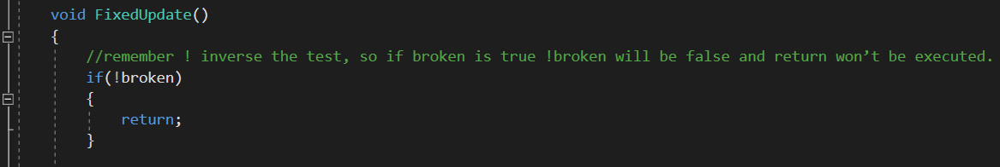
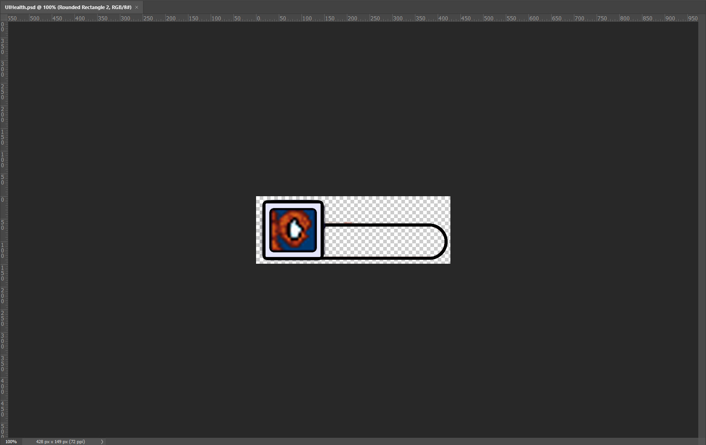
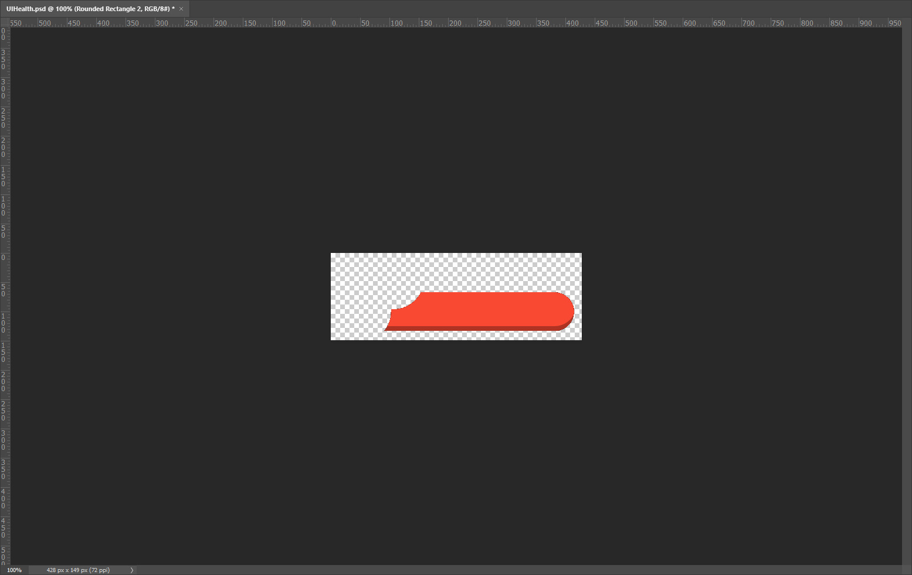

# Lesson: Digital & Serious Games

### First and Last Name: Ανδρέας Μπιρμπίλης | Andreas Birmpilis
### University Registration Number: dpsd19080
### GitHub Personal Profile: [URL](https://github.com/dpsd19080)
### Digital & Serious Games Personal Repository: [URL](https://github.com/dpsd19080/Role-Playing-Game)

# Introduction
Στα πλαίσια του μαθήματος "Ψηφιακά Παιχνίδια και Παιγνιώδης Μάθηση" καλούμε να υλοποιήσω μια ατομική εργασία με θέμα την δημιουργία ενός 2D RPG video game (ελεύθερης θεματολογίας), η οποία αντιστοιχεί στο 60% του τελικού μου βαθμού.
# Summary
Η ατομική εργασία χωρίζεται σε τρία παραδοτέα: 
#### [1st Deliverable](https://github.com/dpsd19080/Role-Playing-Game/tree/main/my_report#1st-deliverable):
#### [2st Deliverable](https://github.com/dpsd19080/Role-Playing-Game/tree/main/my_report#2nd-deliverable):
#### [3st Deliverable](https://github.com/dpsd19080/Role-Playing-Game/tree/main/my_report#3rd-deliverable):

# 1st Deliverable
Ξεκίνησα την εργασία ακολουθώντας τις οδηγίες που μας δόθηκαν για το πρώτο [παραδοτέο](https://github.com/merkourisa/Role-Playing-Game/issues/1). Όταν ξεκίνησα να υλοποιώ τις οδηγίες για το [World Design - Tilemaps](https://learn.unity.com/tutorial/world-design-tilemaps?uv=2020.3&projectId=5c6166dbedbc2a0021b1bc7c) αντιμετώποισα πρόβλημα επειδή οι οδηγίες ήταν outdated, πιο συγκεκριμένα έχει αλλάξει ο τρόπως δημιουργίας των Tilemaps. Παρ ολ' αυτά, με μια γρήγορη αναζήτηση στο YouTube βρήκα αύτο το [βίντεο](https://www.youtube.com/watch?v=DTp5zi8_u1U) που μου έλυσε το πρόβλημα! Ένα επιπλέον πρόβλημα που δημιουργήθηκε ακολουθώντας τις οδηγίες για το [Decorating the World](https://learn.unity.com/tutorial/decorating-the-world?uv=2020.3&projectId=5c6166dbedbc2a0021b1bc7c#) ήταν πως στο βήμα 3 μου ζήταγε να ορίσω τις εξής Transparency Sort Axis συντεταγμένες: 
- x = 0
- y = 1
- z = 0 

Όταν το έκανα έτσι γινόταν αυτό:

Αυτό επιλύθηκε απλά ορίζοντα τις συντεταγμένες έτσι:
- x = 0
- y = 0
- z = 1

Αφού ολοκλήρωσα το πρώτο παραδοτέο μια φόρα με τα assets του [Ruby's Adventure](https://assetstore.unity.com/packages/templates/tutorials/2d-beginner-tutorial-resources-140167) για να καταλάβω την λογική, ξανά έκανα όλη την διαδικασία με τα εξής assets: 
- [Spider-Man Sheets](https://gr.pinterest.com/pin/298504281561510034/)
- [City Tilemaps](https://www.artstation.com/marketplace/p/yr9p8/city-tileset-pack)
- [Crates](https://www.istockphoto.com/vector/pixelated-wooden-box-set-pixel-art-isometric-projection-3d-vector-illustration-gm1210024697-350374351)

Το τελικό αποτέλεσμα πλέον μετά το Bulid and Run είναι αυτό: 

#### Extra προσθήκες που δεν ήταν υποχρεωτικές ακόμα: 
- Προσθήκη Public float speed, με σκοπό να μπορώ να αλλάζω την ταχύτητα ανά πάσα στιγμή, χωρίς να χρειάζεται συνεχής επεξεργασία του script αρχείου για τον χειρισμό του Spider-Man.

 
- Προσθήκη walking animations στον Spider-Man 

# 2nd Deliverable
Σε αυτό το παραδοτέο τα πράγματα πήραν μια πιο ενδιαφέρουσα τροπή.

Πρώτη μου δουλειά (με βάση τις [οδηγίες](https://learn.unity.com/tutorial/world-interactions-blocking-movement?uv=2020.3&projectId=5c6166dbedbc2a0021b1bc7c)) ήταν να διορθώσω το γεγονός ότι ο Spider-Man πέρναγε πάνω από τα boxes στο περιβάλλον αντί να συγκρούεται με αυτά. Αυτό επιτυγχάνεται με την βοήθεια των Colliders.
Κατ ουσίαν, έπρεπε να προσθέσω ένα box collider 2D στον χαρακτήρα μου και αντίστοιχα ένα στο αντικείμενο με το οποίο θέλω να συγκρούεται (στην συγκεκριμένη περίπτωση τα boxes)

Επιπλέον, πρόσθεσα ένα Rigidbody 2D στον Spidey έτσι ώστε να συμπεριφέρεται με βάση την φυσική. Ομως, απενεργοποιώ την βαρύτητα του γιατί δεν θέλω να πέφτει κάτω μιας και το παιχνίδι μου θέλω να είναι Top-Down. 

Αμέσως μετά τοποθέτησα ένα box collider 2D και στο Tilemap με σκοπό να ορίσω τα όρια που θα μπορεί να κινείται ο Spider-Man.

Στην συνέχεια μου ζητήθηκε (από την εκφώνηση του δεύτερου [παραδοτέου](https://github.com/merkourisa/Role-Playing-Game/issues/2)) να φτιάξω Health Collectables τα οποία θα μπορεί να συλλέγει ο χαρακτήρας μου κάθε φορά που "δέχεται" κάποιο damage.
Αρχικά, με την βοήθεια του [World Interactions - Collectibles](https://learn.unity.com/tutorial/world-interactions-collectibles?uv=2020.3&projectId=5c6166dbedbc2a0021b1bc7c) συμπλήρωσα το C# Script "SpiderManController" με στόχο να ορίσω κάποιο Health Stat στον Spider-Man.

#### Πολύ συνοπτικά, ορίζω μια μεταβλητή int με όνομα maxHealth η οποία αντιστοιχεί στην αρχική και μέγιστη ζωή του χαρακτήρα. Αμέσως μετά, ορίζω μια int currentHealth η οποία θα μου επιστρέφει πάντα την τιμή που αντιστοιχεί στην ζωή που έχει ο χαρακτήρας κάθε στιγμή του παιχνιδιού. Όταν ξεκινάει το παιχνίδι, προφανώς η currentHealth είναι ίση με την maxHealth μιας και ο Spider-Man δεν θα έχει δεχθεί κανένα damage κατά την έναρξη του παιχνιδιού. Επιπλέον, έχει δημιουργηθεί μια συνάρτηση ChangeHealth η οποία υπολογίζει συνέχεια την τιμή της currentHealth και την εμφανίζει στο Console.

Έπειτα, βρήκα και τοποθέτησα στα sprites μου το εξής asset για Health Collectable: [Pizza Pixel Art](https://weheartit.com/entry/103348799) 

Του βάζω ένα box collider 2D αλλά αυτή την φορά με την διαφορά ότι "κλικαρω" την επιλογή is Trigger γιατί στην συγκεκριμένη περίπτωση δεν θέλω ο χαρακτήρας να συγκρούεται με το αντικείμενο αλλά κάθε φορά που περνάει από πάνω του να γίνεται Trigger κάποια ενέργεια που θέλω. Ο σκοπό μου είναι κάθε φορά που έχει χάσει ζωή και περνάει από πάνω του να το "μαζεύει" κια να του συμπληρώνετε μια μονάδα ζωής.
Για να το πετύχω αυτό, δημιουργώ ένα ακόμα C# Script με όνομα HealthCollectible:

#### Πολύ συνοπτικά, κάθε φορά που η τρέχουσα ζωή του Spider-Man είναι μικρότερη από την μέγιστη ζωή του, τότε απλά αυξάνει την ζωή κατά 1 και καταστρέφει το object του HealthCollectible.

Όμως, για να δουλέψει όντως αυτό πρέπει να κάνω define κάποιο property στο C# Script του Spider-Man, δηλαδή στο SpiderManController και μετά χρησιμοποιώ αυτό το property στο HealthCollectible.

Κλείνοντας, έκανα prefab το asset Health Collectible έτσι ώστε να μπορώ να το ξανατοποθετήσω στο map όσες φορές θέλω χωρίς να χρειαστεί να το "σετάρω" ξανά και ξανά.

Στη συνέχεια, αφού έχω φτιάξει Health Collectible και έχω ορίσει ζωή στον πρωταγωνιστή μου, ήρθε η ώρα να φτιάξω περιοχές και εχθρούς που θα προκαλούν damage.

Πρώτη κίνηση, δημιουργία νέου C# Script με όνομα DamageZone. Δηλαδή, δημιουργία του κώδικα που θα αφαιρεί 1 πόντο από την ζωή του χαρακτήρα.

Όπως και στο asset για το health έτσι και εδώ, προσθέτουμε box collider 2D με επιλεγμένο το is Trigger. Οι διαφορές όμως στην συγκεκριμένη περίπτωση είναι: 
- Πως δεν θέλουμε να εξαφανίζεται το object (γι' αυτό λείπει και από τον κώδικα η εντολή "Destroy(game.Object);")
- Στο Rigidbody 2D που προσθέσαμε κατά την διάρκεια του tutorial, ορίζουμε το sleeping mode σε never sleep για να βεβαιωθούμε πως ο πρωταγωνιστής μας θα δέχεται ζημιά και όταν κάθεται ακίνητος στο damage zone.

Επειτα, κατά την υλοποίηση παρατήρησα πως ο Spider-Man χάνει με την μια όλες τις ζωές του. Για να το φτιάξω αυτό τροποποίησα τον κώδικα του SpiderManController ως εξής:

Για να ολοκληρώσω τα damage zones έμενε πλέον μονάχα να βάλω ένα στο map να του προσθέσω το DamageZone Script και να το κάνω prefab.

#### Σημείωση: Tο asset του DamageZone: [Broken Glass Pixel Art](https://www.pngkey.com/detail/u2y3q8w7w7i1i1e6_820-x-400-4-broken-glass-pixel-art/)

Επόμενη κίνηση, προσθήκη των εχθρών. 
Παρόμοια λογική και εδώ όπως και με τα προηγούμενα, δημιουργία EnemyController Script και προσθήκη αυτού, προσθήκη Rigidbody 2D και box collider 2D.
Σε αυτή την φάση το EnemyController Script ήταν κάπως έτσι:

Απλά ορίζεται μια ταχύτητα και κατ ουσίαν ακολουθεί μια κατεύθυνση αριστερά και δεξιά ή πάνω και κάτω. 

Τέλος, για προκαλούν και οι εχθροί damage όταν τους ακουμπάει ο πρωταγωνιστής απλώς πρόσθεσα τον παρακάτω κώδικα στο script των εχθρών μου:

#### Σημείωση: Τα assets των εχθρών: [Enemy 1 Sheets](https://twitter.com/creeperofsteam/status/1505997629817331716), [Enemy 2 Sheets](https://www.mediafire.com/convkey/0455/2ojme8ya5fmg7ypzg.jpg?size_id=5)

Επόμενο βήμα, βήμα σιδηρόδρομος, τα Animations. Βήμα εξερετικά απαραίτητο για κάθε game μιας και του δίνει ζωντάνια, χωρίς αυτό το παιχνίδι θα έδειχνε άδειο και αχανές.
Για να μην χαθώ, ακολούθησα κατά γράμμα τις οδηγίες που μας δόθηκαν δόθηκαν για τα [Sprite Animations](https://learn.unity.com/tutorial/sprite-animation?uv=2020.3&projectId=5c6166dbedbc2a0021b1bc7c#). 

Ξεκίνησα (όπως και στο tutorial) με την εξής σειρά:
- Προσθήκη Animator στους εχθρούς μου 
- Δημιουργία Walking (Right and Left) και Death ("Fixed" στο tutorial) animations για τον πρώτο εχθρό.

- Δημιουργία Walking (Up and Down) και Death ("Fixed" στο tutorial) animations για τον δεύτερο εχθρό.

- Δημιουργία Blend Tree 

#### Σημείωση 1: Όπως φάνηκε, δημιούργησα και επεξεργάστικα ένα κοινό Blend Tree και για τους δύο εχθρούς και όχι δύο διαφορετικά. Η αρχική μου προσέγγιση ήταν ο κάθε ένας να έχει το δικό του αλλά υπήρχαν μικροπροβλήματα όπως να μην αλλάζει από WalkingRight σε WalkingLeft. Οπότε σκέφτηκα πως, αφού στο tutorial τα robots θα έκαναν μόνο οριζόντια ή κάθετη κίνηση ανάλογα με τον αν θα έχεις "τσεκαρισμένο" το Vertical στον Inspecot στο κομμάτι που αφορά το EnemyController Script, θα μπορούσα απλά να βάλω στον ένα άξονα τον πρώτο εχθρό και στον άλλον τον δεύτερο(ούτως ή άλλως, σκόπευα να έχουν στον έναν μόνο άξονα κίνηση ο κάθε ένας εχθρός).

#### Σημείωση 2: Η εμπειρία, μου έδειξε πως αν γίνει το παραμικρό λάθος σε οποιαδήποτε στάδιο του Blend Tree απλά όλα τα animation σχεδόν γίνονται προβληματικά ή μπερδεμένα.

- Προσθήκη των εξής εντολών στο EnemyController Script:

Σκοπός είναι να καλέσω των Animator έτσι ώστε κάθε φορά που θα περνάει ένα χρονικό διάστημα και θα έχει διανύσει μια απόσταση να αλλάζει κατεύθυνση και να αλλάζει μαζί και το animation.
- Δημιουργία Idle, Walking (Left and Right), Hit και Launch (θα χρειαστούν για τα projectiles, θα εξηγηθεί αργότερα) animations για τον Spider-Man.

- Δημιουργία τεσσάρων Blend Tree (Idle, Walking, Hit, Launch) για την διαχείριση των animations του Spider-Man 

- Προσθήκη των εξής εντολών στο SpiderManController Script:

Πλέον, μετά από όλα αυτά τα βήματα, τα animations του χαρακτήρας και των εχθρών μου αλλάζουν όποτε πρέπει και σωστά

Προτελευταία απαίτηση ηταν ο χαρακτήρας μου να "πετάει" σφαίρες οι οποίες θα προκαλούν Damage στους εχθρούς. Μιας και ο πρωταγωνιστής μου είναι ο Spider-Man, σαν σφαίρες έφτιαξα στο photoshop ιστούς.
Ξεκίνησα να προσεγγίζω το θέμα ως εξής. Αρχικά, πρόσθεσα το spite μου στο map προσωρινά για να του βάλω Rigidbody 2D και box collider 2D. Έπειτα, συμβουλεύτικα κάποιες ρυθμίσεις από το tutorial που μας είχε υποδεχθεί. Μετά, δημιούργησα ξανά ένα νέο C# Script με όνομα Projectile:

Κάπου εδώ πρόσθεσα στον κώδικα του SpiderManController, την εντολή "animator.SetTrigger("Launch");" με σκοπό να αξιοποίησω το animation που ανέφερα πριν. 

Τώρα, το μόνο που έλειπε ήταν να ορίσω ένα κουμπί στο Script και να καλέσω την Launch(); με στόχο να εκτοξεύει το projectile και να παίζει το animation:

Όμως, δεν είχα τελειώσει ακόμη. Υπήρχαν δύο πρόβλημα που έπρεπε να λύσω ακόμα:
- Το projectile παρότι είχε force και direction έμενε ακίνητο. Αυτό το έλυσα αλλάζοντας την Void start() σε void Awake() στο Projectile Script 
- To projectile έκανε collide με τον χαρακτήρα. Αυτό λύθηκε ορίζοντας "Character" και "Projectile" layers από πάνω δεξιά στον Inspector (προσθέτοντας νέα layers μέσω του layer manager) και πηγαίνοντας στα Project Setting > Physics 2d και κάνοντας uncheck το intersection ανάμεσα σε Character και Projectile.
Τελειώνοντας, έμενε μονάχα να "σκοτώνω" τους εχθρούς όταν τους βρίσκει το projectile και να παίζει το Death animation. 
Αυτό το κατάφερα προσθέτοντας τις έξεις εντολές στα EnemyController και Projectile Scripts αντίστοιχα:

Τέλος, για να ολοκληρωθεί το παραδοτέο έμενε να "φτιάξω" την κάμερα με τέτοιο τρόπο έτσι ώστε να έχει σαν επίκεντρο και να ακολουθεί τον πρωταγωνιστή μου.

Ξεκίνησα κάνοντας εγκατάσταση μέσα από το unity το Cinemachina. Έπειτα έμενε απλά να το ρυθμίσω με βάση τις οδηγίες και να το βάλω να ακολουθεί τον Spider-Man. 

 

Το τελικό αποτέλεσμα πλέον μετά το Bulid and Run είναι αυτό: 

# 3rd Deliverable
 
Στο τελευταίο παραδοτέο ξεκίνησα να ασχολούμαι πρώτα με τα particles. Σκέφτηκα πως μιας και η πρώτη πίστα πραγματοποιήτε σε ταράτσα καλή ιδέα θα ήταν να προσθέσω roof vents και σαν Particles να βάλω τους καπνούς που βγάζουν. Ακολουθώντας τις οδηγείες που μου είχαν δωθεί: [Visual Styling - Particles](https://learn.unity.com/tutorial/visual-styling-particles?uv=2020.3&projectId=5c6166dbedbc2a0021b1bc7c) και κάνοντας τις απαραίτητες μετατροπές, κατέληξα στο εξής αποτέλεσμα (αφότου τα έκανα prefabs και τα πρόσθεσα στα roof vents κάνοντας τα child τους)

#### Σημείωση: Τα vents τα έφτιαξα στο photoshop και τα assets για το smoke/steam effect τα βρήκα εδώ: [Smoke Pixel Art](https://es.123rf.com/photo_136357611_pixel-art-cloud-of-smoke-game-icons-set-comic-boom-flame-effects-for-emotion.html)

  
Επόμενο βήμα, ήταν να δημιουργήσω ένα Head-Up Display για την ζώη του Spider-Man. Στο προηγούμενο παραδοτέο που "έδωσα" ζωή στον Spider-Man, έκανε μονάχα Debug στο Console ενώ τώρα θα φαίνεται στην οθόνη του παιχνιδιού. Αρχικά, έπρεπε (μέσα στο Canvas) να δημιουργήσω ένα Image και να του προσθέσω σαν source το Health Frame 

Στην συνέχεια, με βάση τις [οδηγίες](https://learn.unity.com/tutorial/visual-styling-ui-head-up-display?uv=2020.3&projectId=5c6166dbedbc2a0021b1bc7c#5d7f88fcedbc2a001fd3448d) χρησιμοποίησα το masking technique στο Health Bar, έτσι ώστε να μπορέσει αργότερα με την βοήθεια του κώδικα να παραμορφώνεται ανάλογα το Health Bar Image. 
Τώρα έπρεπε να δημιουργήσω ένα script για να μειώνεται και να αυξάνεται η ζώη όταν ο ήρωας μας δέχεσαι ζημιά ή "σηκώνει" health collectable αντίστοιχα.

Τέλος, για να λειτουργεί πλήρως, έμενε να αντικαταστήσω την εντολή για το debug στο SpiderManController με την εξής εντολή: 

 
#### Σημείωση: Τα Health Frame και Health Bar του Spider-Man τα έφτιαξα στο photoshop

Και κάπως έτσι πλέον είναι ορατή η ζώη του ήρωα μας στον παίκτη 

 
Έπειτα, μου ζητήθηκε από την [εκφώνηση του παραδοτέου](https://github.com/merkourisa/Role-Playing-Game/issues/3) να προσθέσω και ένα Head-Up Display για το score. Μιας και δεν μου δόθηκαν οδηγίες ανέτρεξα στο Youtube. Μετά απο λίγη αναζήτηση βρήκα αυτό το βίντεο: [How to add a score counter into your Unity 2D game| Easy Unity 2D Tutorial](https://www.youtube.com/watch?v=QbqnDbexrCw) το οποίο με βοήθησε να φτιάξω ένα λειτουργικό Head-Up Display που να υπολογίζει το score. Η λογική είναι απλή, μέσα στο canvas δημιουργώ ένα text και το ονομάζω score. Έπειτα δημουργώ νέο script το οποίο προσθέτω με Add Component στο text με όνομα score που δημιούργησα πριν.

#### Πολύ συνοπτικά, απεικονίζει το score με την βοήθεια της scoreValue η οποία "καλείτε" στα HealthCollectible, Collectables και EnemyController scripts, δηλαδή όπου θα πρέπει να προστίθενται πόντοι στο score.

 
Καπου εδώ μου ήρθε η ιδέα να προσθέσω και κάποια extra collectibles έτσι ώστε να μπορεί ο παίκτης να μαζεύει πιο εύκολα και συχνά πόντους 

και απλώς δημιούργησα και τους πρόσθεσα ένα script παρόμοιας λογικής με τα health collectables με σκοπό να μπορεί ο spidey να τα "pickάρει"

  
Πριν ασχοληθώ με το teleport του Spidey, έπρεπε να δημιουργήσω τις άλλες δύο πίστες του παιχνιδιού, το δεύτερο level και το Boss level. Αρχικά, ξεκίνησα δημιουργούντας δύο νέα scenes, ένα για την δεύτερη και ένα για το boss level. Όπως και στην πρώτη πίστα, έτσι και εδώ ακολούθησα ττο βίτνεο [Creating Tilemaps For Your 2D Game in Unity 2021 - Tutorial](https://www.youtube.com/watch?v=DTp5zi8_u1U)

Στην συνέχεια, "διακόσμησα" το Level με τους κακούς μου και τα collectables κάνοντας τα drag and drop από τα prefabs έτσι ώστε να μην χρειαστεί να τα ξαναφτίαξω απο την αρχή. Επειδή είναι και η δεύτερη πίστα έκανα τους enemies πιο επιθετικούς και περισσότερους. 

#### Σημείωση 1: Για το πως έκανα τους εχθρούς να επιτίθενται θα το αναλύσω πιο κάτω, στο κομμάτι που μιλάω για το boss μιας και κατα την διάρκεια υλοποιήσεις του το έφτιαξα και αργότερα το πρόσθεσα στους enemies

#### Σημείωση 2: Στα Level 2 και boss Level σαν particles έχω βάλει τον καπνό των κεριών (Χρησιμοποίησα το ίδιο asset με τα roof vents, απλώς το διαμόρφωσα καταλλήλως)

Τώρα, σχετικά με το Boss, συνδύασα δύο διαφορετικές λογικές από δύο διαφορετικά βίντεο. Με την βοήθεια του [Enemy AI in Unity2D #3 A enemy that moves and shoots towards the player](https://www.youtube.com/watch?v=lHLZxd0O6XY&t=314s) έφτιαξα το script που κάνει τον Venom και τους εχθρούς να "πετάνε" ιστούς και σφαίρες αντίστοιχα: 

#### Πολύ συνοπτικά, εντοπίζουν τον Spidey και όταν βρίσκεται σε μια συγκεκριμένη απόσταση (την οποία ορίζω εγώ χάρη στις μεταβλητές), αρχίζουν να πυροβολάνε τον ήρωα μας. Αξίζει να σημειώθει επίσης, πως έχουν φτιαχτεί μεταβλητές και κώδικας έτσι ώστε να ακολουθούν τον Spider-Man αλλά δεν χρησιμοποιήθηκε μιας και χρειαζόταν μόνο στον Venom και επιπλέον υλοποιήθηκε με καλύτερο τρόπο χάρη στο άλλο βίντεο.  

Με την βοήθεια του [How to make a BOSS in Unity!](https://www.youtube.com/watch?v=AD4JIXQDw0s&t=1149s) αρχικά έφτιαξα τον Animator του Venom έπειτα ένα script που "flipάρει" το Boss κάθε φορά που πηγαίνει ο spidey από πίσω του.

Και τέλος ένα script ώστε ο venom κυνηγάει τον ήρωα μας

Επιπλέον, δημιούργησα ένα script ίδιας λογικής με του προηγούμενου παραδοτέου για να "δώσω" ζωή στο boss και ξανά ένα Head-Up Display.

#### Σημείωση 1: Τα Health Frame και Health Bar του Venom τα έφτιαξα στο photoshop

#### Σημείωση 2: Τα assets του Venom τα βρήκα εδώ: [BEU Venom JUS Sprite sheet](https://www.deviantart.com/danorenovado/art/BEU-Venom-JUS-Sprite-sheet-861158725)

Αφού ξεμπερδέψα με αυτά, μπορούσα να ασχοληθώ με το teleport. Επειδή δυσκολεύτηκα κάπως με το raycast και δεν κατάφερα να το κάνω να λειτουργεί σωστά, αποφάσισα να το προσεγγίσω διαφορετικά. Οπότε βασίστηκα στην λογική ενώς απο τα βιντεο που ειδα για την δημιουργία menu και μετάβαση από αυτό στην πρώτη πίστα

#### Πολύ συνοπτικά, έφτιαξα ένα αντικείμενο (συγκεκριμένα την μαύρη τρύπα) και του έδωσα ενα collider με επιλεγμένο το isTrigger έτσι ώστε κάθε φορά που ο spidey το "πατάει" να πηγαίνει στο επόμενο scene.

Επόμενο και πολύ σημαντικό βήμα, έπρεπε να προσθέσω ήχους στο παιχνίδι μου. Ξεκίνησα προσθέτοντας ήχο στα backgrounds των levels. Αυτό το πέτυχα δημιουργώντας ένα empty GameObject και κάνοντας Add Component ένα Audio Source. Μετά απλά έκανα drag and drop το audio στο source

Στην συνέχεια, με βάση το tutorial [Audio](https://learn.unity.com/tutorial/audio-muz?uv=2020.3&projectId=5c6166dbedbc2a0021b1bc7c#) απλώς έπρεπε να βάλω Audio Source σε ό,τι ήθελα να παράγει ήχο και τις εξής εντολές στα αντίστοιχα scripts
 - Στο SpiderManController
 
 
 
 
 
 - Στο Collectables
 
 
 - Στο EnemyController
  
 
 - Στο HealthCollectible

 - Στο VenomHealth1
 
 

 Menu
buttons kai scripts 
Τελευταίο βήμα 

pause 
game over 
you win 

# Conclusions

# Sources
#### 1st Deliverable:
- [Get started with Ruby’s Adventure](https://learn.unity.com/tutorial/main-character-and-first-script?uv=2020.3&projectId=5c6166dbedbc2a0021b1bc7c)
- [Character Controller and Keyboard Input](https://learn.unity.com/tutorial/character-controller-and-keyboard-input?uv=2020.3&projectId=5c6166dbedbc2a0021b1bc7c)
- [World Design - Tilemaps](https://learn.unity.com/tutorial/world-design-tilemaps?uv=2020.3&projectId=5c6166dbedbc2a0021b1bc7c)
- [Decorating the World](https://learn.unity.com/tutorial/decorating-the-world?uv=2020.3&projectId=5c6166dbedbc2a0021b1bc7c)
- [Creating Tilemaps For Your 2D Game in Unity 2021 - Tutorial](https://www.youtube.com/watch?v=DTp5zi8_u1U)
- [Ruby's Adventure](https://assetstore.unity.com/packages/templates/tutorials/2d-beginner-tutorial-resources-140167)
- [Spider-Man Sheets](https://gr.pinterest.com/pin/298504281561510034/)
- [City Tilemaps](https://www.artstation.com/marketplace/p/yr9p8/city-tileset-pack)
- [Crates](https://www.istockphoto.com/vector/pixelated-wooden-box-set-pixel-art-isometric-projection-3d-vector-illustration-gm1210024697-350374351)

#### 2nd Deliverable:
- [World Interactions - Blocking Movement](https://learn.unity.com/tutorial/world-interactions-blocking-movement?uv=2020.3&projectId=5c6166dbedbc2a0021b1bc7c)
- [World Interactions - Collectibles](https://learn.unity.com/tutorial/world-interactions-collectibles?uv=2020.3&projectId=5c6166dbedbc2a0021b1bc7c)
- [World Interactions - Damage Zones and Enemies](https://learn.unity.com/tutorial/world-interactions-damage-zones-and-enemies?uv=2020.3&projectId=5c6166dbedbc2a0021b1bc7c)
- [Sprite Animation](https://learn.unity.com/tutorial/sprite-animation?uv=2020.3&projectId=5c6166dbedbc2a0021b1bc7c#)
- [World Interactions - Projectile](https://learn.unity.com/tutorial/world-interactions-projectile?uv=2020.3&projectId=5c6166dbedbc2a0021b1bc7c)
- [Camera - Cinemachine](https://learn.unity.com/tutorial/camera-cinemachine?uv=2020.3&projectId=5c6166dbedbc2a0021b1bc7c)
- [Pizza Pixel Art](https://weheartit.com/entry/103348799) 
- [Broken Glass Pixel Art](https://www.pngkey.com/detail/u2y3q8w7w7i1i1e6_820-x-400-4-broken-glass-pixel-art/)
- [Enemy 1 Sheets](https://twitter.com/creeperofsteam/status/1505997629817331716)
- [Enemy 2 Sheets](https://www.mediafire.com/convkey/0455/2ojme8ya5fmg7ypzg.jpg?size_id=5)
